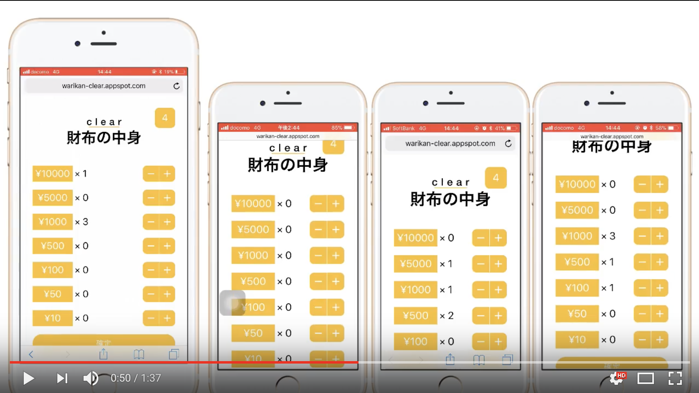

# clear

  
動画上では、プレゼン資料の作成上動作の同期が遅延しているように見えるが、実際にはリアルタイムで処理内容を同期している。
また、画面の最後で「10900円ずつ、余り0円でした。」とあるが、10900円は支払い金額の合計である。そのため、実際にはここに1人あたりに支払う金額が表示される。
## 製品概要
### 現金 X Tech

### 背景（製品開発のきっかけ、課題等）
飲み会や懇親会で楽しく食事をし、支払いを行う際に割り勘を行う場面があるが、これには手間を要する。
- 小銭を多く持っている人とお札しか持っていない人がいる中、対等にお金を支払わなければいけない
- 特にお酒が入っている場合、細かい小銭の計算を間違える恐れがある
- 既存のアプリ等ではアカウント登録などの煩雑な前処理が必要である

これらの問題を解決するために、私たちは「clear」を作成した。

### 製品説明（具体的な製品の説明）
「clear」は割り勘を容易にするWebアプリケーションである。  
幹事は「clear」を起動し、支払いの合計金額を入力する。  
そうすると、QRコードが表示されるため、割り勘を行うグループでQRコードの読み込みを行う。  
(又は、URLをAirDrop等で共有する)  
これらの操作により、割り勘を行うグループのルームが作成される。  
次に各々が所有する小銭やお札を入力する。  
全ての人の入力が終了し、幹事が入力を締め切ると、各々が誰にお金を渡すかを算出し、表示する。
これによって「clear」が最適な支払い手順、及び支払い額を提示し、公平に割り勘を行うことが出来る。    

### 特長

#### 1. アプリ不要
Webアプリケーションなので、**ほとんどのデバイス**で「clear」を利用できる環境がある。
#### 2. QRコード
QRコードを読み取るだけで、割り勘を行うグループのルームに入ることができる。
#### 3. 独自のアルゴリズム
**独自のアルゴリズム**により、細かい金銭のやり取りを計算しなくても良い
。
### 解決出来ること
飲み会で煩雑な割り勘を行う計算を「clear」にまかせることで、楽に済ませることができる。  
また、割り勘に対応したクレジットカードやアカウントが必要な割り勘アプリとは違い、登録不要なWebアプリケーションであるため、特定のカードやアカウントを必要とせず、手軽に利用することが出来る。

### 今後の展望
今後の展望としては、周辺店舗の広告の掲載である。
「clear」にGPS情報とグループの予算額から、適当な周辺店舗の広告を掲載することで、二次会の店舗情報を効率よく広告することが出来る。

## 開発内容・開発技術
### 活用した技術
* WebSocket
* Node.js
* node Express
* node ws
* Vue.js
* QArt.js
* Google App Engine

### 研究内容・事前開発プロダクト（任意）
* ありません(2日間のみ)

### 独自開発技術（Hack Dayで開発したもの）
#### 2日間に開発した独自の機能・技術

* #### 独自の清算アルゴリズム  
飲み会に参加した全員が、同じ金額を支払うように計算する最適なアルゴリズムである。  
大抵の場合、幹事と参加者とのお釣りのやり取りを行うが、このアルゴリズムでは、参加者同士でも金銭のやり取りを行うことで、最適な支払い手順を導いている。時にはAさんがBさんへ、BさんがCさんへ、CさんがAさんへ支払いを行うことで負担を軽減できるようになっている。
